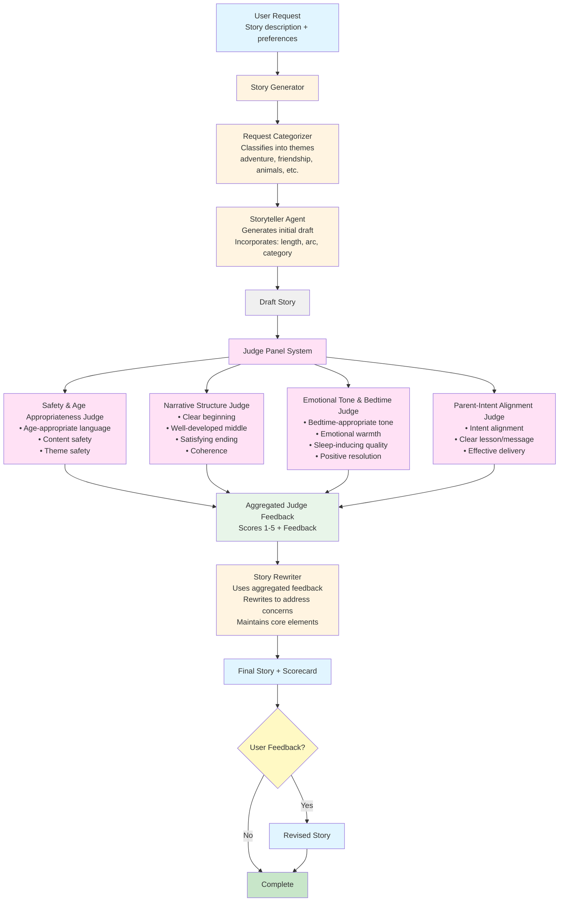

# Hippocratic AI Coding Assignment
Welcome to the [Hippocratic AI](https://www.hippocraticai.com) coding assignment

## Instructions
The attached code is a simple python script skeleton. Your goal is to take any simple bedtime story request and use prompting to tell a story appropriate for ages 5 to 10.
- Incorporate a LLM judge to improve the quality of the story
- Provide a block diagram of the system you create that illustrates the flow of the prompts and the interaction between judge, storyteller, user, and any other components you add
- Do not change the openAI model that is being used. 
- Please use your own openAI key, but do not include it in your final submission.
- Otherwise, you may change any code you like or add any files

---

## Rules
- This assignment is open-ended
- You may use any resources you like with the following restrictions
   - They must be resources that would be available to you if you worked here (so no other humans, no closed AIs, no unlicensed code, etc.)
   - Allowed resources include but not limited to Stack overflow, random blogs, chatGPT et al
   - You have to be able to explain how the code works, even if chatGPT wrote it
- DO NOT PUSH THE API KEY TO GITHUB. OpenAI will automatically delete it

---

## What does "tell a story" mean?
It should be appropriate for ages 5-10. Other than that it's up to you. Here are some ideas to help get the brain-juices flowing!
- Use story arcs to tell better stories
- Allow the user to provide feedback or request changes
- Categorize the request and use a tailored generation strategy for each category

---

## How will I be evaluated
Good question. We want to know the following:
- The efficacy of the system you design to create a good story
- Are you comfortable using and writing a python script
- What kinds of prompting strategies and agent design strategies do you use
- Are the stories your tool creates good?
- Can you understand and deconstruct a problem
- Can you operate in an open-ended environment
- Can you surprise us

---

## Other FAQs
- How long should I spend on this? 
No more than 2-3 hours
- Can I change what the input is? 
Sure
- How long should the story be?
You decide

---

## Setup Instructions

### Prerequisites
- Python 3.7 or higher
- OpenAI API key

### Installation

1. **Clone or download this repository**

2. **Set up a virtual environment (recommended):**
   ```bash
   python -m venv venv
   ```

3. **Activate the virtual environment:**
   - On macOS/Linux:
     ```bash
     source venv/bin/activate
     ```
   - On Windows:
     ```bash
     venv\Scripts\activate
     ```

4. **Install dependencies:**
   ```bash
   pip install -r requirements.txt
   ```

5. **Set your OpenAI API key:**
   - On macOS/Linux:
     ```bash
     export OPENAI_API_KEY="your-api-key-here"
     ```
   - On Windows (CMD):
     ```cmd
     set OPENAI_API_KEY=your-api-key-here
     ```
   - On Windows (PowerShell):
     ```powershell
     $env:OPENAI_API_KEY="your-api-key-here"
     ```

## Running the Application

### Command Line Interface (CMD/Terminal)

Run the CLI version:
```bash
python main.py
```

The CLI will prompt you to:
1. Enter your story request
2. Choose story length (short, medium, long)
3. Select a learning/emotional theme
4. View the generated story with judge panel scorecard
5. Optionally provide feedback for revisions

### Streamlit Web Interface

Run the web UI:
```bash
streamlit run app.py
```

The Streamlit app will automatically open in your browser at `http://localhost:8501` with a user-friendly interface for generating bedtime stories.

**Features in the Streamlit UI:**
- Interactive story generation form
- Visual judge panel scorecard with scores and feedback
- Story revision capability
- Download story as text file

## High-Level Architecture

The Bedtime Story Generator uses a multi-agent architecture with specialized components:



### Key Components

1. **Story Generator** (`story_generator.py`)
   - Categorizes user requests
   - Generates initial story drafts based on length, arc, and category preferences

2. **Judge Panel System** (`story_improviser.py`)
   - **4 Specialized Judges**: Each evaluates the story from a different perspective
   - **Transparent Evaluation**: All judges provide scores (1-5) and feedback
   - **Aggregated Feedback**: Combines all judge feedback for story improvement

3. **Story Rewriter**
   - Uses judge panel feedback to improve the story
   - Maintains faithfulness to original request while addressing concerns

4. **User Interface**
   - **CLI** (`main.py`): Command-line interface for terminal users
   - **Streamlit** (`app.py`): Web-based UI with visual scorecard display

### Model Configuration
- **LLM Model**: GPT-3.5-turbo (as specified in requirements)
- **Temperature**: Varies by component (0.3 for judges, 0.4-0.85 for generation)

### Data Flow
1. User provides story request and preferences
2. System categorizes request and generates draft
3. **Judge Panel** evaluates draft across 4 dimensions
4. Feedback is aggregated and used to rewrite story
5. Final story + scorecard displayed to user
6. Optional: User provides feedback for further revisions